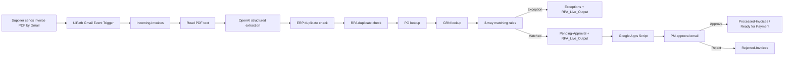

# RPA 3-Way Invoice Matching & Approval

A reusable invoice-processing solution built with **UiPath Studio Web**, **Gmail**, **Google Drive**, **Google Sheets**, **OpenAI**, and **Google Apps Script**.

The solution automates invoice intake, AI-assisted extraction, duplicate detection, PO/GRN validation, 3-way matching, exception routing, PM approval, escalation, and final document routing.

> **UiPath distribution model**
>
> The UiPath automation is distributed as a **UiPath Studio Web Template**. This repository intentionally does **not** contain a `.uis` export or authenticated UiPath connection metadata.

---

## UiPath template

**Template name:** `RPA - Invoice Intake & 3-Way Matching`

To create your own copy:

```text
UiPath Automation Cloud
→ Studio Web
→ Templates
→ Search for "RPA - Invoice Intake & 3-Way Matching"
→ Use template
→ Create project
→ Configure your own connections
→ Test
→ Deploy
```

See **[docs/UIPATH_TEMPLATE.md](docs/UIPATH_TEMPLATE.md)** for the complete guide.

### Template availability

If the template is published at **Organization level**, the user must belong to the same UiPath organization to find it by name.

Users outside that UiPath organization need the template to be distributed through another supported UiPath channel, such as Marketplace, before they can discover it.

---

## Architecture



---

## Responsibilities

### UiPath Studio Web

- Gmail invoice intake trigger.
- Download PDF attachments.
- Copy incoming invoice PDFs to Google Drive.
- Read PDF text.
- Use OpenAI to extract structured invoice fields.
- Check simulated ERP duplicates in `Existing_Invoices`.
- Check RPA duplicates in `RPA_Live_Output`.
- Look up PO and GRN master data.
- Apply 3-way matching rules.
- Write every outcome to `RPA_Live_Output`.
- Route exceptions to `Exceptions`.
- Route matched invoices to `Pending-Approval`.

### Google Apps Script

- Scan `MATCHED` invoices awaiting PM approval.
- Resolve the current pending PDF using `Process_ID` and immutable Google Drive File ID.
- Send Approve / Reject email links.
- Update approval status and audit columns.
- Send reminder/escalation emails.
- Move approved PDFs to `Processed-Invoices`.
- Move rejected PDFs to `Rejected-Invoices`.

### Google Sheets / mock ERP

- `PO_Data`: PO master data.
- `GRN_Data`: goods-receipt data.
- `Existing_Invoices`: invoices that already exist in the simulated ERP/accounting system.
- `RPA_Live_Output`: processing/audit output and RPA duplicate history.
- `Pending_File_Map`: `Process_ID` ↔ immutable Google Drive File ID mapping.
- `Config`: approval, escalation, email, OCR, and currency configuration.

---

## Matching / exception rules

Decision order:

1. Data quality / OCR threshold when a real OCR confidence value exists.
2. Missing PO.
3. Missing GRN.
4. Duplicate invoice.
5. Quantity mismatch.
6. Price mismatch.
7. Calculation error.
8. Otherwise `MATCHED` → PM approval.

| Exception | Owner |
|---|---|
| Qty Mismatch | PM |
| Price Mismatch | PM |
| Calc Error | PM |
| Missing GRN | Warehouse |
| Missing PO | PM |
| Data Quality / OCR | FC |
| Duplicate | FC |
| Other | FC |

Approval aging rules are driven by the `Config` sheet:

| Age | Action |
|---:|---|
| 24h | PM reminder |
| 48h | Finance Manager escalation |
| 72h | Urgent Finance Manager + CFO escalation |

Approved invoices are marked **Ready for Payment**. Payment itself is simulated; the project does not call a banking/payment API.

---

## Required Google Drive structure

```text
RPA-Invoice-Matching/
├── Data/
│   └── RPA_3Way_Data
├── Incoming-Invoices/
├── Pending-Approval/
├── Exceptions/
├── Processed-Invoices/
└── Rejected-Invoices/
```

See **[docs/GOOGLE_DRIVE_STRUCTURE.md](docs/GOOGLE_DRIVE_STRUCTURE.md)**.

---

## Required Google Sheet tabs

```text
PO_Data
GRN_Data
Existing_Invoices
RPA_Live_Output
Config
Pending_File_Map
Test_Cases (optional)
```

`Existing_Invoices` represents invoices that **already exist in the simulated ERP/accounting system**. Do not automatically add every newly received invoice to this sheet.

For RPA-side duplicate detection, `RPA_Live_Output` is also checked using invoice reference plus supplier identity.

### Pending_File_Map

Required columns:

```text
Invoice_Reference
Drive_File_ID
Source_File_Name
Registered_At
Process_ID
```

`Process_ID` is the primary correlation key for new processing runs. This prevents a stale mapping such as an old `01 (1).pdf` from being reused when a new `01.pdf` is processed later.

---

## Repository structure

```text
.
├── README.md
├── SETUP.md
├── SECURITY.md
├── .gitignore
│
├── apps-script/
│   └── RPA_Invoice_Approval.gs
│
├── config/
│   ├── Config_Template.csv
│   ├── PO_Data_Sample.csv
│   ├── GRN_Data_Sample.csv
│   ├── Existing_Invoices_Template.csv
│   ├── RPA_Live_Output_Headers.csv
│   ├── Pending_File_Map_Headers.csv
│   └── settings.example.json
│
├── docs/
│   ├── UIPATH_TEMPLATE.md
│   ├── CONNECTIONS_SETUP.md
│   ├── APPS_SCRIPT_SETUP.md
│   ├── GOOGLE_DRIVE_STRUCTURE.md
│   ├── GOOGLE_SHEETS_SCHEMA.md
│   ├── TESTING.md
│   ├── architecture.png
│   └── flowchart.png
│
└── tests/
    ├── Regression_Test_Matrix.csv
    ├── ERP_Duplicate_Seed.csv
    └── test invoice PDFs
```

### Intentionally not included

```text
*.uis exports
Connections/
connections/
.connections/
OAuth tokens
API keys
UiPath authenticated connection metadata
Google credentials
OpenAI credentials
```

---

## Quick start

1. Confirm you can access the UiPath template.
2. In Studio Web, open **Templates** and search for `RPA - Invoice Intake & 3-Way Matching`.
3. Click **Use template** to create your own project copy.
4. Create the required Google Drive folders.
5. Create the `RPA_3Way_Data` spreadsheet and required tabs.
6. Configure your own Gmail, Google Drive, Google Sheets, and OpenAI connections in UiPath.
7. Rebind the template activities to your connections and Google resources.
8. Configure `apps-script/RPA_Invoice_Approval.gs` with your Google resource IDs.
9. Deploy Apps Script as a Web App and set `WEB_APP_URL` in Script Properties.
10. Run `setupApprovalInfrastructure()` once.
11. Deploy the UiPath process and verify the Gmail event trigger is enabled.
12. Run a clean matched invoice test.
13. Run the regression test pack.

Full instructions: **[SETUP.md](SETUP.md)**.

---

## Security

Every user must authenticate their **own** connections. This repository must never contain:

- OpenAI API keys.
- Gmail/Google OAuth tokens.
- UiPath Integration Service credentials.
- service-account private keys.
- passwords or bearer tokens.
- exported connection folders containing authenticated metadata.

See **[SECURITY.md](SECURITY.md)**.
